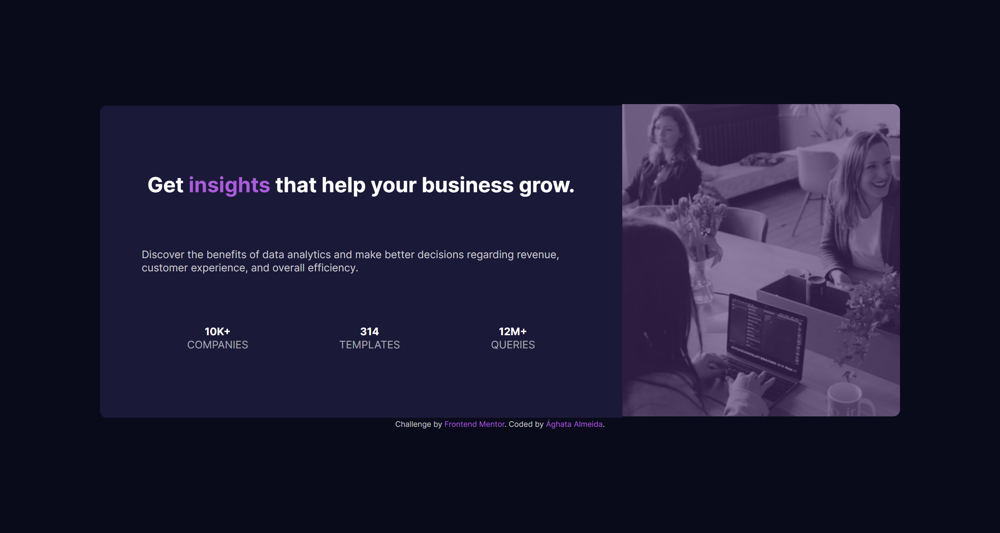

Frontend Mentor - Card de resultados

Essa é uma solução para [ Desafio: Stats preview card component](https://www.frontendmentor.io/challenges/stats-preview-card-component-8JqbgoU62).

## Índice

- [Visão Geral](#desafio)
  - [The challenge](#the-challenge)
  - [Screenshot](#screenshot)
  - [Links](#links)
  - [Ferramentas](#ferramentas)
- [Contato](#contato)

## Visão Geral

### Desafio

O objetivo do desafio era criar um card totalmente responsivo que exiba o melhor layout de acordo com o tamanho de tela do usuário.
Users should be able to:

### Screenshot

- Visualização em tela de 320px:
  
- Visualização em tela de 1440px:
  

### Links

- Solution URL: [Add solution URL here](https://your-solution-url.com)
- Live Site URL: [Add live site URL here](https://your-live-site-url.com)

### Ferramentas

- HTML5
- CSS
- Flexbox
- SCSS

## Contato

- Frontend Mentor - [@a-almeida10](https://www.frontendmentor.io/profile/a-almeida10)
- Linkedin - [Ághata Almeida](https://www.linkedin.com/in/aghata-almeida/)
